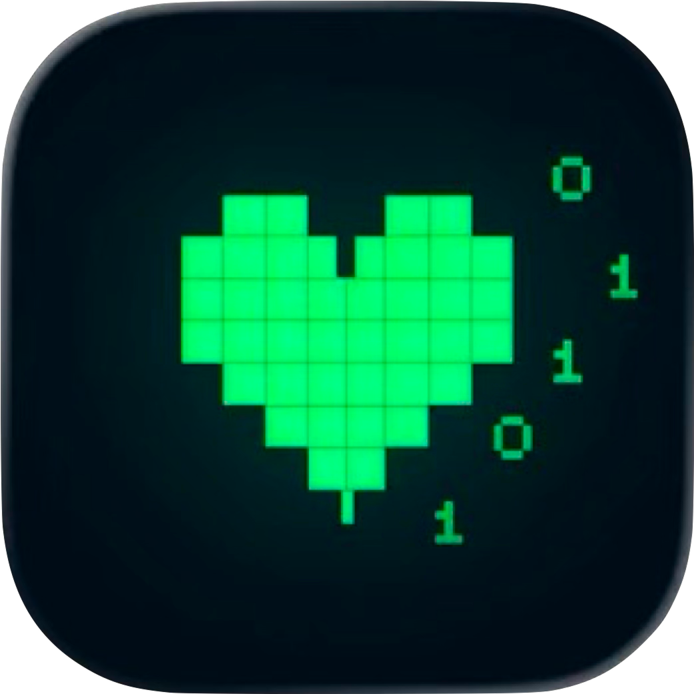
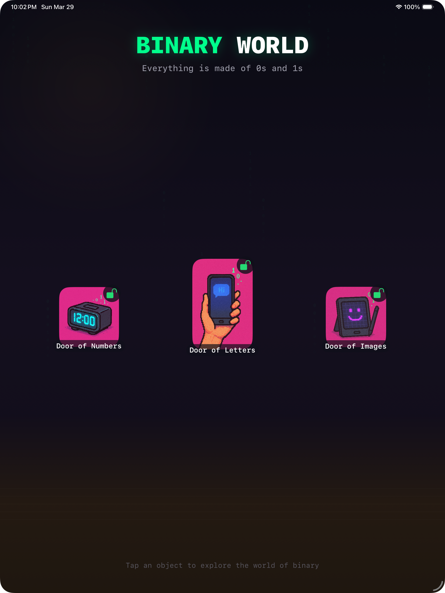
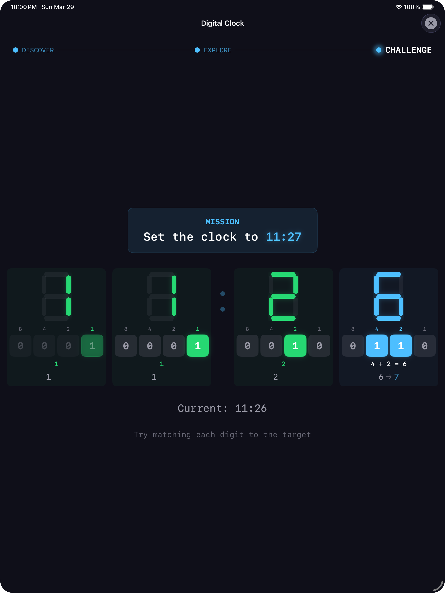
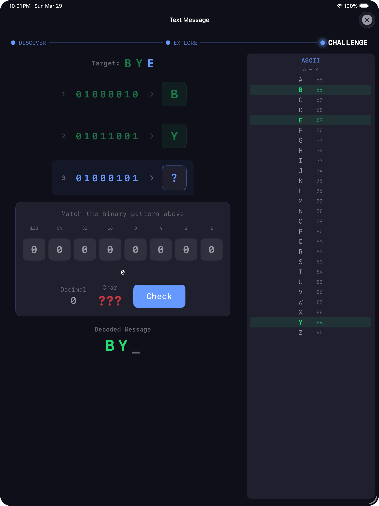
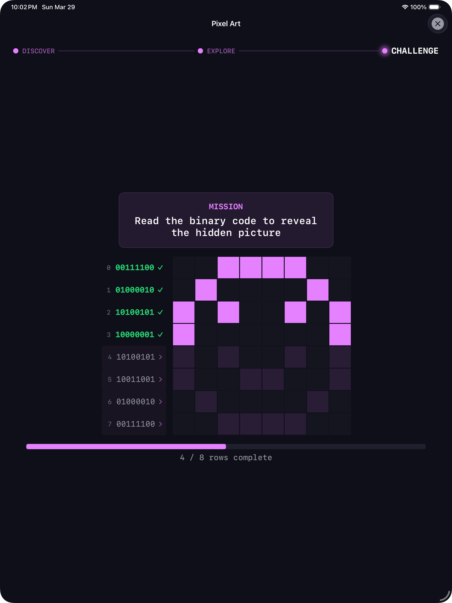

# Binary World

<table>
<tr>
<td width="30%" align="center">

  

  
Available on iPad & macOS
</td>
<td width="40%" valign="middle">
<h3>Everything is made of 0s and 1s.</h3>
An interactive app where you experience how computers convert numbers, text, and images into binary — through visual, hands-on gameplay designed for anyone, no coding background needed.
  

> 🏆 **Apple Swift Student Challenge 2026 — Winner**
</td>
<td width="30%" align="center">
<a href="[https://github.com/jsonpassion/BinaryWorld/blob/main/video/vid.mp4](https://github.com/user-attachments/assets/de1ba173-3450-4491-bb86-cbed9533cc64)">
   
  🎥 Watch Demo Video 💫
</a>
</td>
</tr>
</table>

---

## Missions

<table>
<tr>
<th align="center">🏠 Lobby</th>
<th align="center">🕐 Digital Clock</th>
<th align="center">💬 Text Message</th>
<th align="center">🎨 Pixel Art</th>
</tr>
<tr>
<td align="center"></td>
<td align="center"></td>
<td align="center"></td>
<td align="center"></td>
</tr>
<tr>
<td valign="top">Choose a mission. Each one reveals a different layer of how binary powers the digital world.</td>
<td valign="top">Tap a clock digit to reveal <b>7 segments</b> and discover <b>BCD</b> — the 4-bit binary behind every number. Toggle bits to set the time.</td>
<td valign="top">Watch "Hi" decompose into <b>ASCII</b> codes and raw 0s and 1s. Decode a hidden 3-letter message byte by byte.</td>
<td valign="top">A heart pixelates into an <b>8×8 binary grid</b>. Each pixel is one bit — read binary hints and fill in the blanks.</td>
</tr>
</table>

---

| **Platform** | **Built with** | **Data Collection** | **Privacy** |
|:---:|:---:|:---:|:---:|
| iPad & macOS (iPadOS 26+) | SwiftUI | None | [Policy](privacy.md) |

Built by [Jason J. Lee — Tech Mentor @ Apple Developer Academy POSTECH](https://www.linkedin.com/in/json-lee)
